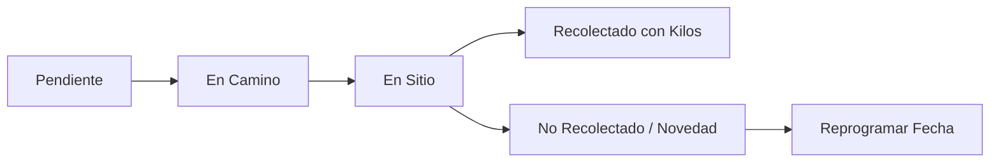

# 📋 Nota Técnica y Roadmap de Mejoras Operativas - SyncPoint

Este documento recopila la especificación técnica, diseño de base de datos, flujos de trabajo e interfaces requeridas para la implementación de las siguientes mejoras clave en la plataforma **SyncPoint**:

1. **Conductor asignado por Ruta**.
2. **Direcciones físicas y georreferenciación de Clientes**.
3. **Control de Kilos por Recolectar (Estimados y Reales)**.
4. **Sistema de Prioridades en las Recolecciones**.
5. **Seguimiento del Conductor y su Jornada**.
6. **Seguimiento detallado de Recolecciones en Terreno**.
7. **Monitoreo y Navegación por Mapa para Conductores y Despacho**.

---

## 📌 1. Conductor Asignado para la Ruta

### 🎯 Objetivo
Permitir que cada ruta operativa tenga asignado un conductor responsable predeterminado (y opcionalmente datos del vehículo), permitiendo filtrar eventos, reportes y métricas por transportista.

### 🗄️ Modificaciones en Base de Datos (PostgreSQL)
```sql
ALTER TABLE SyncPoint.rutas 
    ADD COLUMN conductor_id BIGINT REFERENCES SyncPoint.usuarios(id) ON DELETE SET NULL,
    ADD COLUMN vehiculo_placa VARCHAR(20),
    ADD COLUMN vehiculo_descripcion VARCHAR(100);
```

### ⚙️ Cambios en API y Backend (`core/rutas.php`)
- **GET**: Retornar `conductor_id`, `conductor_nombre`, `conductor_telefono`, `vehiculo_placa` en el objeto de cada ruta.
- **POST / PUT**: Permitir recibir `conductor_id`, `vehiculo_placa` y `vehiculo_descripcion` al crear o editar una ruta.
- **Validación**: Asegurar que el usuario asignado tenga rol o tipo correspondiente (`conductor` o `transportista`).

---

## 📌 2. Direcciones y Georreferenciación de Clientes

### 🎯 Objetivo
Registrar la dirección física completa de los clientes, sector/barrio y sus coordenadas geográficas (`latitud`, `longitud`) para facilitar la navegación del conductor y el trazado de rutas en mapa.

### 🗄️ Modificaciones en Base de Datos (PostgreSQL)
```sql
ALTER TABLE SyncPoint.clientes 
    ADD COLUMN direccion TEXT,
    ADD COLUMN barrio VARCHAR(100),
    ADD COLUMN complemento_direccion VARCHAR(100), -- Ej: "Local 201", "Bodega B"
    ADD COLUMN latitud NUMERIC(10, 7),
    ADD COLUMN longitud NUMERIC(10, 7),
    ADD COLUMN referencias_entrega TEXT; -- Ej: "Timbrar portón negro, preguntar por Don Carlos"
```

### ⚙️ Cambios en API y Backend (`core/clientes.php`)
- **GET**: Incluir campos de dirección y coordenadas en listados y vista detallada.
- **POST / PUT**: Aceptar los nuevos campos de dirección y geolocalización.
- **Geocodificación Automática (Opcional)**: Integrar servicio de geocodificación (Nominatim/OpenStreetMap o Google Maps API) para sugerir lat/lng a partir de la dirección escrita.

---

## 📌 3. Asignación y Control de Kilos por Recolectar

### 🎯 Objetivo
Gestionar tanto los **kilos estimados** a recolectar (para planificar la capacidad del vehículo de carga) como los **kilos reales recolectados** al momento de finalizar la visita.

### 🗄️ Modificaciones en Base de Datos (PostgreSQL)
```sql
-- Kilos estimados promedio habituales por cliente
ALTER TABLE SyncPoint.clientes 
    ADD COLUMN promedio_kilos_estimados NUMERIC(10, 2) DEFAULT 0;

-- Kilos en el evento puntual de recolección
ALTER TABLE SyncPoint.eventos 
    ADD COLUMN kilos_estimados NUMERIC(10, 2) DEFAULT 0,
    ADD COLUMN kilos_recolectados NUMERIC(10, 2) DEFAULT NULL,
    ADD COLUMN canecas_o_recipientes INT DEFAULT 0;
```

### ⚙️ Lógica de Negocio y Operación
1. **Al proyectar eventos automáticos**: El sistema asigna automáticamente a `kilos_estimados` el valor de `promedio_kilos_estimados` del cliente.
2. **Cálculo de Carga Total por Día/Ruta**: El dashboard y el despacho suman `SUM(kilos_estimados)` para evaluar si la ruta supera la capacidad de carga del vehículo asignado.
3. **Cierre de Recolección**: El conductor o despachador registra los `kilos_recolectados` reales, actualizando el promedio histórico del cliente.

---

## 📌 4. Prioridades en las Recolecciones

### 🎯 Objetivo
Identificar servicios urgentes o clientes con almacenamiento a punto de desbordar para que el conductor y despachador prioricen la parada en el orden del día.

### 🗄️ Modificaciones en Base de Datos (PostgreSQL)
```sql
ALTER TABLE SyncPoint.eventos 
    ADD COLUMN prioridad VARCHAR(20) DEFAULT 'media' NOT NULL;
    -- Valores permitidos: 'baja', 'media', 'alta', 'urgente'

ALTER TABLE SyncPoint.eventos 
    ADD CONSTRAINT chk_eventos_prioridad 
    CHECK (prioridad IN ('baja', 'media', 'alta', 'urgente'));
```

### 🎨 Visualización en Frontend
- **Badges de color en tarjetas de eventos**:
  - 🔴 `urgente`: Borde rojo brillante con animación o icono de alarma.
  - 🟠 `alta`: Naranja ámbar.
  - 🔵 `media`: Azul pizarra neutro.
  - ⚪ `baja`: Gris tenue.
- **Filtro de Prioridad**: Nuevo dropdown en la barra superior del Dashboard para ordenar y filtrar paradas por nivel de urgencia.

---

## 📌 5. Seguimiento del Conductor

### 🎯 Objetivo
Proporcionar a los supervisores visibilidad del estado de la jornada de cada conductor y facilitar una vista simplificada en el móvil para que el conductor gestione sus entregas asignadas del día.

### 🗄️ Modificaciones en Base de Datos (PostgreSQL)
```sql
CREATE TABLE SyncPoint.jornadas_conductores (
    id BIGSERIAL PRIMARY KEY,
    conductor_id BIGINT REFERENCES SyncPoint.usuarios(id) ON DELETE CASCADE,
    ruta_id BIGINT REFERENCES SyncPoint.rutas(id) ON DELETE SET NULL,
    fecha DATE NOT NULL DEFAULT CURRENT_DATE,
    hora_inicio TIMESTAMP WITH TIME ZONE DEFAULT CURRENT_TIMESTAMP,
    hora_fin TIMESTAMP WITH TIME ZONE,
    estado VARCHAR(30) DEFAULT 'iniciada', -- 'iniciada', 'en_ruta', 'en_pausa', 'finalizada'
    kilometraje_inicial NUMERIC(10, 2),
    kilometraje_final NUMERIC(10, 2),
    total_kilos_recolectados NUMERIC(10, 2) DEFAULT 0,
    observaciones TEXT
);
```

### 📱 Vista Especial para el Conductor (PWA / Mobile View)
- Modo lista secuencial de paradas del día.
- Botones de un toque:
  - 📞 *Llamar por WhatsApp / Teléfono* al cliente.
  - 🧭 *Navegar con Waze / Google Maps* con la dirección registrada.
  - 📦 *Registrar Kilos y Recibo*.

---

## 📌 6. Seguimiento Detallado de Recolecciones en Terreno

### 🎯 Objetivo
Monitorear el ciclo de vida operativo de cada evento en terreno más allá de la confirmación por WhatsApp (`programado`, `notificacion1`, `aceptado`).

### 🗄️ Ciclo de Estados Operativos en Terreno
```sql
ALTER TABLE SyncPoint.eventos 
    ADD COLUMN estado_operativo VARCHAR(30) DEFAULT 'pendiente',
    ADD COLUMN hora_llegada_sitio TIMESTAMP WITH TIME ZONE,
    ADD COLUMN hora_completado TIMESTAMP WITH TIME ZONE,
    ADD COLUMN motivo_no_recoleccion TEXT,
    ADD COLUMN comprobante_firma TEXT, -- URL de imagen o firma digital
    ADD COLUMN comprobante_foto TEXT;  -- Foto de caneca o comprobante físico

ALTER TABLE SyncPoint.eventos 
    ADD CONSTRAINT chk_eventos_estado_operativo 
    CHECK (estado_operativo IN ('pendiente', 'en_camino', 'en_sitio', 'recolectado', 'no_recolectado', 'reprogramado'));
```

### 🔄 Flujo de Trabajo Operativo


---

## 📌 7. Seguimiento por Mapa para Conductores y Despacho

### 🎯 Objetivo
Visualizar geográficamente las recolecciones programadas, generar la ruta óptima de paradas y mostrar la posición del conductor en tiempo real.

### 🗺️ Componentes Técnicos
1. **Librería de Mapas**: Integración con **Leaflet.js** con OpenStreetMap (gratuito y ligero, sin costos de API obligatorios) o **Google Maps JavaScript API**.
2. **Pines por Estado y Prioridad**:
   - 🟢 Verde: Recolección completada.
   - 🟡 Amarillo: En camino / próxima parada.
   - 🔴 Rojo / Alerta: Alta prioridad o urgente.
   - ⚪ Gris: Pendiente para más tarde en el día.
3. **Trazado de Rutas (Routing)**:
   - Integración con OSRM (Open Source Routing Machine) o Google Directions para conectar las paradas en secuencia lógica evitando desvíos innecesarios.
4. **Geolocalización en Tiempo Real del Conductor**:
   - Registro de coordenadas periódicas mediante la API de Geolocalización de HTML5 del navegador del conductor (`navigator.geolocation.watchPosition`).
   - Envío de coordenadas a un endpoint ligero (`/app/api/operaciones/posicion_conductor.php`) cada 30-60 segundos.
   - Vista de "Torre de Control" en el panel de despacho mostrando el vehículo avanzando por la ciudad.

---

## 🏗️ Propuesta de Fases de Implementación

| Fase | Alcance | Módulos Implicados |
| :--- | :--- | :--- |
| **Fase 1: Datos Base** | Dirección en Clientes + Kilos Estimados/Reales + Prioridades | `clientes.php`, `eventos.php`, vistas y modales de edición |
| **Fase 2: Asignación** | Asignación de Conductor a Ruta + Filtro de Eventos por Conductor | `rutas.php`, `eventos.php`, sidebar y filtros de dashboard |
| **Fase 3: Operación Terreno** | Estados operativos (`en_camino`, `en_sitio`, `recolectado`) + Registro móvil de Kilos | Módulo y modal de cierre de recolección |
| **Fase 4: Georreferenciación y Mapa** | Coordenadas lat/lng de clientes + Vista de Mapa de Paradas del Día (Leaflet) | Nuevo tab o modal interactiva de Mapa Logístico |
| **Fase 5: Telemetría en Vivo** | GPS del conductor en vivo + Torre de control en despacho | Endpoint de streaming/polling de posición y tracking en mapa |
