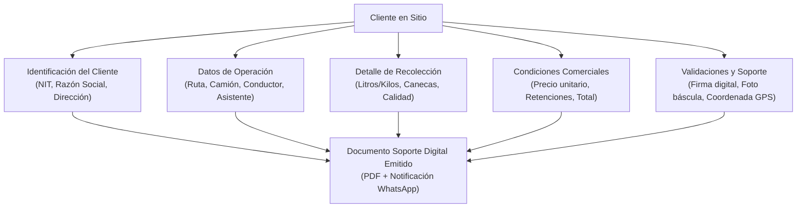
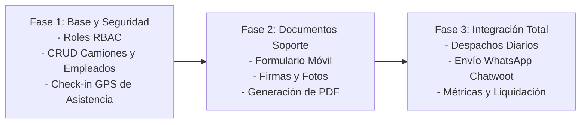

# 🚀 Propuesta de Nuevos Desarrollos: Flota, Empleados, Asistencia y Documentos Soporte

Este documento consolida la propuesta de arquitectura, modelo de datos y diseño funcional para la expansión del sistema **SyncPoint (OilBless)**, aprovechando la infraestructura de rutas existente e incorporando la gestión de personal, camiones, control de asistencia con geolocalización y emisión digital de documentos soporte en campo.

---

## 📋 Tabla de Contenido
1. [Contexto y Objetivos](#1-contexto-y-objetivos)
2. [Matriz de Roles y Permisos (RBAC)](#2-matriz-de-roles-y-permisos-rbac)
3. [Módulo 1: Gestión de Flota (Camiones) y Tripulación (Empleados)](#3-módulo-1-gestión-de-flota-camiones-y-tripulación-empleados)
4. [Módulo 2: Control de Asistencia y Turnos con Geolocalización](#4-módulo-2-control-de-asistencia-y-turnos-con-geolocalización)
5. [Módulo 3: Procesamiento de Documentos Soporte en Sitio](#5-módulo-3-procesamiento-de-documentos-soporte-en-sitio)
6. [Diseño de Base de Datos (PostgreSQL)](#6-diseño-de-base-de-datos-postgresql)
7. [Arquitectura de API y Endpoints Propuestos](#7-arquitectura-de-api-y-endpoints-propuestos)
8. [Propuesta de Experiencia de Usuario (UI/UX Móvil y Web)](#8-propuesta-de-experiencia-de-usuario-uiux-móvil-y-web)
9. [Plan de Implementación y Fases de Despliegue](#9-plan-de-implementación-y-fases-de-despliegue)

---

## 1. Contexto y Objetivos

Actualmente **SyncPoint** cuenta con la administración de **Sucursales**, **Rutas/Zonas**, **Clientes**, **Frecuencias** y **Eventos de Recolección**, además de la integración con **Chatwoot** para mensajería.

Para elevar la eficiencia operativa de OilBless, se identificaron cuatro necesidades críticas:
1. **Asignación operativa de Rutas**: Vincular camiones y tripulantes (conductor + asistente) a las rutas programadas del día.
2. **Control de Asistencia en Campo**: Registrar la hora exacta de ingreso y la ubicación geográfica (GPS) del empleado al iniciar su jornada o ruta.
3. **Emisión de Documentos Soporte Digitales**: Permitir que el equipo en campo capture los datos de la compra/recolección de aceite usado (cantidades, calidad, precios, retenciones), tome firmas digitales y genere el documento soporte de inmediato al cliente.
4. **Seguridad y Segregación de Funciones**: Garantizar que conductores y asistentes solo puedan registrar asistencia y documentos soporte, sin autorización para alterar la programación de rutas, clientes ni configuración del sistema.

---

## 2. Matriz de Roles y Permisos (RBAC)

Para cumplir con la restricción solicitada, se propone evolucionar el campo `tipo` de la tabla `usuarios` o implementar un esquema de roles formales:

### Definición de Roles

| Rol | Descripción | Acceso a la Plataforma |
| :--- | :--- | :--- |
| **`administrador`** | Control total técnico y funcional del sistema. | Dashboard completo, configuración, usuarios, liquidaciones. |
| **`coordinador_logistica`** | Programa rutas, asigna camiones y tripulación, gestiona clientes y eventos. | Panel administrativo web (escritorio/tablet). |
| **`conductor`** | Conduce el vehículo asignado, registra asistencia y emite documentos soporte en los clientes visitados. | Interfaz móvil simplificada ("Portal de Ruta"). |
| **`asistente`** (Auxiliar) | Apoya la recolección física, registra asistencia y co-certifica o apoya la captura del documento. | Interfaz móvil simplificada ("Portal de Ruta"). |
| **`contador` / `auditor`** | Revisa, aprueba y exporta los documentos soporte y compras para efectos contables y tributarios. | Módulo contable de documentos soporte. |

### Matriz de Permisos por Módulo

| Módulo / Acción | Administrador | Coordinador Logística | Conductor | Asistente |
| :--- | :---: | :---: | :---: | :---: |
| **Programar y Reordenar Rutas** | ✅ Total | ✅ Total | ❌ **Denegado** | ❌ **Denegado** |
| **Crear / Editar Clientes y Tarifas** | ✅ Total | ✅ Total | ❌ **Denegado** | ❌ **Denegado** |
| **Ver su Hoja de Ruta Asignada (Día)** | ✅ Total | ✅ Total | ✅ Solo asignada | ✅ Solo asignada |
| **Registro de Asistencia (Ingreso GPS)** | ✅ Supervisión | ✅ Supervisión | ✅ Propio | ✅ Propio |
| **Crear Documento Soporte en Sitio** | ✅ Total | ✅ Total | ✅ Permitido | ✅ Permitido |
| **Firmar y Subir Evidencia Fotográfica** | ✅ Total | ✅ Total | ✅ Permitido | ✅ Permitido |
| **Anular / Modificar Doc. Soporte Emitido** | ✅ Total | ⚠️ Requiere Aprobación | ❌ Solo lectura tras cierre | ❌ Solo lectura |
| **Configuración General y Usuarios** | ✅ Total | ❌ Denegado | ❌ Denegado | ❌ Denegado |

> [!IMPORTANT]
> **Mecanismo de Control en Backend**:
> La restricción no solo debe aplicarse en la interfaz visual ocultando botones, sino en cada controlador/servicio backend (`app/services/core/...` y `app/api/...`), verificando en la sesión el rol del usuario autenticado mediante un middleware o helper `AuthHelper::requireRole(['administrador', 'coordinador_logistica'])`. Si un conductor intenta invocar un endpoint de programación de eventos o rutas, el servidor responderá inmediatamente con `HTTP 403 Forbidden`.

---

## 3. Módulo 1: Gestión de Flota (Camiones) y Tripulación (Empleados)

### 3.1. Gestión de Camiones (`vehiculos`)
Permite registrar y monitorear la flota vehicular de la empresa.
* **Datos básicos**: Placa (única), marca, modelo, año, color, número de chasis/motor.
* **Capacidad**: Capacidad de carga máxima (kg) y volumen de almacenamiento de canecas/litros.
* **Documentación y vencimientos**:
  * Fecha de vencimiento SOAT.
  * Fecha de vencimiento Revisión Técnico-Mecánica (RTM).
  * Pólizas contractuales y extracontractuales (si aplica para transporte de residuos/sustancias).
  * Alertas automáticas en el dashboard ante documentos próximos a vencer.
* **Estado**: `activo`, `mantenimiento`, `inactivo`.
* **Sucursal Base**: Vinculado a la sucursal donde pernocta el vehículo.

### 3.2. Gestión de Empleados (`empleados`)
Permite registrar a los colaboradores de campo vinculándolos a su cuenta de acceso del sistema:
* **Datos personales**: Cédula de ciudadanía, nombres, apellidos, teléfono WhatsApp, contacto de emergencia, tipo de sangre (RH).
* **Datos laborales**: Cargo (`conductor`, `asistente`, `coordinador`), fecha de ingreso, estado (`activo`, `vacaciones`, `incapacidad`, `retirado`).
* **Datos de conducción**: Número de licencia, categoría (ej. C1, C2), fecha de vencimiento.
* **Vinculación con Usuario**: Llave foránea `usuario_id` hacia la tabla `usuarios` para el inicio de sesión.

### 3.3. Asignación Operativa: Despacho Diario de Ruta (`despachos_rutas`)
Aprovechando la tabla actual de `rutas` y `eventos`:
* Diariamente o semanalmente, el Coordinador asigna a cada ruta:
  1. Un camión principal.
  2. Un conductor responsable.
  3. Uno o dos asistentes auxiliares.
  4. Fecha de operación.
  5. Kilometraje inicial y final del camión.
* Esto permite que, cuando el conductor abre la aplicación móvil, el sistema reconozca automáticamente: *"Ruta Asignada: Jueves Centro | Camión: ABC-123 | Asistente: Juan Pérez | Clientes a recolectar: 18"*.

---

## 4. Módulo 2: Control de Asistencia y Turnos con Geolocalización

### 4.1. Flujo de Marcación de Ingreso (Check-in)
Cuando el empleado (conductor o asistente) llega a iniciar su jornada:
1. Accede al sistema desde su teléfono móvil y presiona el botón principal: **"Marcar Ingreso de Turno"**.
2. El navegador solicita permisos de geolocalización a través de la **HTML5 Geolocation API** (`navigator.geolocation.getCurrentPosition`).
3. El sistema captura con alta precisión:
   * **Latitud y Longitud** exactas.
   * **Margen de precisión en metros** (`accuracy`).
   * **Marca de tiempo del servidor** (para evitar manipulación de la hora del dispositivo móvil).
4. El backend valida:
   * Si la coordenada se encuentra dentro del radio permitido (Geocerca) de la sucursal o patio de camiones asignado (ej. margen de 300 metros).
   * Si está fuera del rango, permite registrar el ingreso pero lo marca con advertencia: *"Ingreso remoto / Fuera de base"* con observación obligatoria.
5. Se registra la foto selfie del empleado (opcional para validación biométrica visual).

### 4.2. Flujo de Marcación de Salida (Check-out)
Al finalizar la ruta o la jornada laboral:
* El empleado presiona **"Finalizar Turno / Salida"**.
* Se capturan nuevamente las coordenadas GPS, la hora de salida, el kilometraje final del vehículo y observaciones del turno (novedades mecánicas o de ruta).
* El sistema calcula las horas efectivas laboradas.

---

## 5. Módulo 3: Procesamiento de Documentos Soporte en Sitio

El documento soporte es el comprobante mercantil y fiscal que acredita la recolección y adquisición de aceite vegetal usado (AVU) o residuos a los clientes (restaurantes, hoteles, cafeterías, casinos), muchos de los cuales no están obligados a expedir factura electrónica.

### 5.1. Datos Requeridos en el Documento Soporte



#### A. Cabecera y Consecutivo
* **Número Consecutivo**: Prefijo y número secuencial oficial de la empresa (ej. `DS-001452`).
* **Fecha y Hora de Emisión**: Timestamp exacto generado en servidor.
* **Sucursal Emisora**: Sede de OilBless a la que pertenece la ruta.

#### B. Datos del Cliente (Proveedor del residuo)
* Nombre o Razón Social.
* Tipo y Número de Documento (NIT con dígito de verificación o Cédula).
* Dirección física del local y Ciudad.
* Teléfono de contacto / WhatsApp.
* Tipo de régimen tributario.

#### C. Datos de la Operación y Logística
* Conductor responsable.
* Asistente de ruta.
* Camión / Placa del vehículo recolector.
* Evento de recolección asociado (para actualizar automáticamente el evento a estado `completado`).

#### D. Detalle del Producto / Residuo Recolectado
* **Tipo de residuo**: Aceite Vegetal Usado (AVU), Grasa industrial, etc.
* **Unidad de medida**: Litros, Galones, Kilos, o Canecas (55 gal).
* **Cantidad bruta y tara**: Peso de canecas vacías vs. peso bruto para obtener peso neto.
* **Cantidad neta recolectada**.
* **Control de Calidad en Sitio**:
  * Nivel de humedad / agua visible (% o prueba rápida).
  * Presencia de sólidos / impurezas.
  * Acidez estimada.

#### E. Liquidación Financiera
* **Precio unitario acordado** (por litro, galón o kilo).
* **Subtotal bruto**.
* **Retenciones fiscales** (ReteFuente, ReteICA, si aplican según régimen).
* **Valor neto a pagar** al cliente.
* **Medio de pago**:
  * Efectivo (entregado en el momento por el conductor de caja menor de ruta).
  * Transferencia bancaria (programada por administración).
  * Donación / Certificado de disposición ambiental sin cobro.
  * Canje por insumos/limpieza.

#### F. Evidencias y Seguridad Jurídica
* **Geolocalización del comprobante**: Coordenadas GPS del punto de expedición para verificar que se emitió realmente en las instalaciones del cliente.
* **Firma digital del Cliente**: Capturada en pantalla táctil con nombre y documento de quien entrega.
* **Firma digital del Conductor / Recolector**.
* **Evidencias fotográficas adjuntas**:
  * Foto de las canecas o báscula con la cantidad marcada.
  * Foto de planilla física o comprobante adicional (si aplica).

#### G. Salida y Notificación Automática
1. Generación de **PDF descargable** con diseño oficial de OilBless y código QR de verificación.
2. Envío automático del comprobante en PDF al WhatsApp del cliente mediante la integración existente de **Chatwoot**.
3. Envío opcional por correo electrónico.

---

## 6. Diseño de Base de Datos (PostgreSQL)

A continuación se presenta la propuesta de esquema SQL normalizado e integrado con las tablas actuales (`usuarios`, `rutas`, `clientes`, `eventos`, `sucursales`):

```sql
-- 1. EXTENSIÓN DE ROLES PARA USUARIOS
-- Si se mantiene la columna 'tipo' en usuarios, actualizar los tipos permitidos:
-- 'administrador', 'coordinador_logistica', 'conductor', 'asistente', 'contador'

-- 2. TABLA DE CAMIONES / VEHÍCULOS
CREATE TABLE IF NOT EXISTS vehiculos (
    id SERIAL PRIMARY KEY,
    placa VARCHAR(10) UNIQUE NOT NULL,
    marca VARCHAR(50),
    modelo VARCHAR(50),
    anio INTEGER,
    capacidad_carga_kg NUMERIC(10,2),
    capacidad_canecas INTEGER,
    fecha_vencimiento_soat DATE,
    fecha_vencimiento_rtm DATE,
    estado VARCHAR(20) DEFAULT 'activo' CHECK (estado IN ('activo', 'mantenimiento', 'inactivo')),
    fk_sucursal INTEGER REFERENCES sucursales(id) ON DELETE SET NULL,
    created_at TIMESTAMP DEFAULT CURRENT_TIMESTAMP,
    updated_at TIMESTAMP DEFAULT CURRENT_TIMESTAMP
);

-- 3. TABLA DE EMPLEADOS
CREATE TABLE IF NOT EXISTS empleados (
    id SERIAL PRIMARY KEY,
    usuario_id INTEGER UNIQUE REFERENCES usuarios(id) ON DELETE SET NULL,
    nombres VARCHAR(100) NOT NULL,
    apellidos VARCHAR(100) NOT NULL,
    documento_tipo VARCHAR(10) DEFAULT 'CC',
    documento_numero VARCHAR(30) UNIQUE NOT NULL,
    telefono VARCHAR(30),
    cargo VARCHAR(30) NOT NULL CHECK (cargo IN ('conductor', 'asistente', 'coordinador', 'otro')),
    licencia_numero VARCHAR(50),
    licencia_categoria VARCHAR(10),
    licencia_vencimiento DATE,
    estado VARCHAR(20) DEFAULT 'activo' CHECK (estado IN ('activo', 'inactivo', 'vacaciones', 'incapacidad')),
    created_at TIMESTAMP DEFAULT CURRENT_TIMESTAMP,
    updated_at TIMESTAMP DEFAULT CURRENT_TIMESTAMP
);

-- 4. CONTROL DE ASISTENCIA Y TURNOS (CHECK-IN / CHECK-OUT)
CREATE TABLE IF NOT EXISTS asistencias (
    id SERIAL PRIMARY KEY,
    empleado_id INTEGER NOT NULL REFERENCES empleados(id) ON DELETE CASCADE,
    fecha DATE NOT NULL DEFAULT CURRENT_DATE,
    
    -- Ingreso
    hora_ingreso TIMESTAMP NOT NULL DEFAULT CURRENT_TIMESTAMP,
    latitud_ingreso NUMERIC(10, 7),
    longitud_ingreso NUMERIC(10, 7),
    precision_gps_ingreso NUMERIC(8, 2), -- metros
    direccion_ingreso TEXT,
    ingreso_dentro_rango BOOLEAN DEFAULT TRUE,
    
    -- Salida
    hora_salida TIMESTAMP,
    latitud_salida NUMERIC(10, 7),
    longitud_salida NUMERIC(10, 7),
    precision_gps_salida NUMERIC(8, 2),
    direccion_salida TEXT,
    
    kilometraje_inicial NUMERIC(10, 2),
    kilometraje_final NUMERIC(10, 2),
    observaciones TEXT,
    estado VARCHAR(20) DEFAULT 'abierto' CHECK (estado IN ('abierto', 'cerrado', 'anulado')),
    created_at TIMESTAMP DEFAULT CURRENT_TIMESTAMP
);

-- 5. DESPACHOS DIARIOS DE RUTA (VINCULACIÓN RUTA - CAMIÓN - TRIPULACIÓN)
CREATE TABLE IF NOT EXISTS despachos_rutas (
    id SERIAL PRIMARY KEY,
    ruta_id INTEGER NOT NULL REFERENCES rutas(id) ON DELETE CASCADE,
    vehiculo_id INTEGER NOT NULL REFERENCES vehiculos(id) ON DELETE RESTRICT,
    conductor_id INTEGER NOT NULL REFERENCES empleados(id) ON DELETE RESTRICT,
    asistente_id INTEGER REFERENCES empleados(id) ON DELETE SET NULL,
    fecha_despacho DATE NOT NULL,
    estado VARCHAR(20) DEFAULT 'programado' CHECK (estado IN ('programado', 'en_curso', 'finalizado', 'cancelado')),
    hora_inicio TIMESTAMP,
    hora_fin TIMESTAMP,
    kilometraje_salida NUMERIC(10,2),
    kilometraje_llegada NUMERIC(10,2),
    observaciones TEXT,
    created_at TIMESTAMP DEFAULT CURRENT_TIMESTAMP
);

-- 6. DOCUMENTOS SOPORTE
CREATE TABLE IF NOT EXISTS documentos_soporte (
    id SERIAL PRIMARY KEY,
    consecutivo VARCHAR(30) UNIQUE NOT NULL,
    fecha_emision TIMESTAMP NOT NULL DEFAULT CURRENT_TIMESTAMP,
    
    -- Relaciones
    cliente_id INTEGER NOT NULL REFERENCES clientes(id) ON DELETE RESTRICT,
    evento_id INTEGER REFERENCES eventos(id) ON DELETE SET NULL,
    despacho_id INTEGER REFERENCES despachos_rutas(id) ON DELETE SET NULL,
    conductor_id INTEGER NOT NULL REFERENCES empleados(id),
    asistente_id INTEGER REFERENCES empleados(id),
    vehiculo_id INTEGER REFERENCES vehiculos(id),
    
    -- Resumen de Carga
    tipo_residuo VARCHAR(50) DEFAULT 'Aceite Vegetal Usado (AVU)',
    unidad_medida VARCHAR(20) DEFAULT 'Litros' CHECK (unidad_medida IN ('Litros', 'Galones', 'Kilos', 'Canecas')),
    cantidad_bruta NUMERIC(12, 2) NOT NULL,
    tara NUMERIC(12, 2) DEFAULT 0.00,
    cantidad_neta NUMERIC(12, 2) NOT NULL,
    numero_canecas INTEGER DEFAULT 0,
    
    -- Parámetros de Calidad
    porcentaje_agua NUMERIC(5, 2) DEFAULT 0.00,
    porcentaje_impurezas NUMERIC(5, 2) DEFAULT 0.00,
    observacion_calidad TEXT,
    
    -- Valores Económicos
    precio_unitario NUMERIC(12, 2) NOT NULL DEFAULT 0.00,
    subtotal NUMERIC(12, 2) NOT NULL DEFAULT 0.00,
    retencion_fuente NUMERIC(12, 2) DEFAULT 0.00,
    retencion_ica NUMERIC(12, 2) DEFAULT 0.00,
    total_neto NUMERIC(12, 2) NOT NULL DEFAULT 0.00,
    metodo_pago VARCHAR(30) DEFAULT 'efectivo' CHECK (metodo_pago IN ('efectivo', 'transferencia', 'donacion', 'canje', 'credito')),
    
    -- Georreferenciación en Sitio
    latitud_emision NUMERIC(10, 7),
    longitud_emision NUMERIC(10, 7),
    precision_gps NUMERIC(8, 2),
    
    -- Evidencias y Firmas
    firma_cliente_url TEXT,
    nombre_firmante_cliente VARCHAR(100),
    documento_firmante_cliente VARCHAR(30),
    firma_conductor_url TEXT,
    foto_evidencia_url TEXT,
    foto_bascula_url TEXT,
    
    -- Estado y PDF
    pdf_url TEXT,
    enviado_whatsapp BOOLEAN DEFAULT FALSE,
    estado VARCHAR(20) DEFAULT 'emitido' CHECK (estado IN ('emitido', 'anulado', 'liquidado')),
    motivo_anulacion TEXT,
    created_at TIMESTAMP DEFAULT CURRENT_TIMESTAMP,
    updated_at TIMESTAMP DEFAULT CURRENT_TIMESTAMP
);

-- Índices recomendados para optimización
CREATE INDEX IF NOT EXISTS idx_asistencias_emp_fecha ON asistencias(empleado_id, fecha);
CREATE INDEX IF NOT EXISTS idx_despachos_fecha ON despachos_rutas(fecha_despacho);
CREATE INDEX IF NOT EXISTS idx_doc_soporte_cliente ON documentos_soporte(cliente_id);
CREATE INDEX IF NOT EXISTS idx_doc_soporte_fecha ON documentos_soporte(fecha_emision);
CREATE INDEX IF NOT EXISTS idx_doc_soporte_despacho ON documentos_soporte(despacho_id);
```

---

## 7. Arquitectura de API y Endpoints Propuestos

Siguiendo la arquitectura actual de SyncPoint (`app/api/core/...`, `app/controllers/core/...`, `app/services/core/...` y `app/models/core/...`), se proponen los siguientes endpoints:

### 7.1. Flota y Empleados
* `GET|POST|PUT|DELETE /app/api/core/vehiculos.php`
  * CRUD de camiones, consulta con filtros de estado y sucursal. *(Solo Administrador / Logística)*
* `GET|POST|PUT|DELETE /app/api/core/empleados.php`
  * CRUD de empleados, asignación de cargos y vinculación con cuentas de usuario. *(Solo Administrador / Logística)*
* `GET|POST|PUT /app/api/core/despachos.php`
  * Programación y cierre de rutas con camión + tripulación. *(Solo Administrador / Logística)*

### 7.2. Asistencia y Turnos (Check-in GPS)
* `POST /app/api/campo/checkin.php`
  * **Acceso**: `conductor`, `asistente`.
  * **Payload**: `{ latitud, longitud, precision, kilometraje_inicial, observaciones }`.
  * Registra la hora exacta de ingreso y la ubicación.
* `POST /app/api/campo/checkout.php`
  * **Acceso**: `conductor`, `asistente`.
  * **Payload**: `{ asistencia_id, latitud, longitud, kilometraje_final, observaciones }`.
* `GET /app/api/core/asistencias.php`
  * **Acceso**: `administrador`, `coordinador_logistica`.
  * Reporte consolidado de horas y ubicaciones de ingreso/salida de la tripulación.

### 7.3. Documentos Soporte en Campo
* `GET /app/api/campo/mi_ruta_hoy.php`
  * **Acceso**: `conductor`, `asistente`.
  * Retorna los clientes asignados en el día con su orden de visita y estado (pendiente / completado).
  * **Importante**: No permite modificar ni agregar nuevos eventos de ruta.
* `POST /app/api/campo/documentos_soporte.php`
  * **Acceso**: `conductor`, `asistente`.
  * Procesa la captura en sitio: cliente, litros, canecas, calidad, precio, coordenadas GPS, firma en canvas (Base64/PNG), fotos de evidencia.
  * Genera el documento y actualiza el evento de recolección a completado.
* `GET /app/api/core/documentos_soporte.php`
  * **Acceso**: `administrador`, `coordinador_logistica`, `contador`.
  * Listado general paginado, filtros por fecha, cliente, ruta, conductor, exportación a Excel/CSV.
* `GET /app/api/campo/documento_soporte_pdf.php?id={id}`
  * Generación y visualización del PDF del documento soporte.
* `POST /app/api/campo/enviar_whatsapp.php`
  * Disparo de la plantilla de mensaje con el PDF adjunto mediante el conector de **Chatwoot**.

---

## 8. Propuesta de Experiencia de Usuario (UI/UX)

Se sugiere dividir la interfaz en dos experiencias según el rol del usuario autenticado:

### A. Vista Móvil "Portal de Campo" (Conductores y Asistentes)
* **Diseño orientado a smartphones (PWA / Responsive Mobile-First)**:
  * Botones grandes y contrastados aptos para uso en calle o con guantes.
  * Modo rápido de marcación:
    1. **Botón superior**: "🟢 Marcar Ingreso" con feedback visual del GPS ("Ubicación capturada: Base Ibagué").
    2. **Lista de Recolecciones del Día**: Tarjetas simples de cada cliente (Nombre, Dirección, botón directo para abrir Google Maps / Waze).
    3. **Botón en tarjeta de cliente**: "📝 Generar Documento Soporte".
* **Formulario Asistido de Documento Soporte (Paso a Paso)**:
  * **Paso 1 - Carga**: Selección de canecas y litros (calculadora rápida de tara).
  * **Paso 2 - Liquidación**: Cálculo automático del total a pagar según tarifa configurada.
  * **Paso 3 - Verificación**: Captura de fotos (botón directo a la cámara del teléfono).
  * **Paso 4 - Firma**: Lienzo táctil (HTML5 Canvas) para que el encargado del restaurante firme con el dedo.
  * **Paso 5 - Finalizar y Enviar**: Guarda el registro, obtiene GPS en background y pregunta: *"¿Enviar copia por WhatsApp al cliente?"*.

### B. Vista Web Administrativa (Coordinación y Gerencia)
* Pestañas adicionales en el Sidebar existente de SyncPoint:
  * 🚚 **Flota**: Control de camiones, alertas de SOAT y mantenimientos.
  * 👷 **Personal**: Listado de empleados y credenciales de acceso.
  * ⏱️ **Asistencias**: Mapa de calor o listado con pines en mapa de dónde ingresaron los empleados y sus horarios.
  * 📄 **Documentos Soporte**: Auditoría de recolecciones, validación de firmas, montos pagados y exportación a contabilidad.

---

## 9. Plan de Implementación y Fases de Despliegue



### Fase 1: Estructura, Roles y Asistencia (Semana 1 - 2)
1. Extender los roles de usuario (`administrador`, `coordinador_logistica`, `conductor`, `asistente`).
2. Implementar middleware de validación de permisos en el backend.
3. Crear tablas y CRUDs de **Camiones** (`vehiculos`) y **Empleados** (`empleados`).
4. Desarrollar módulo de **Asistencia con Geolocalización** (Check-in/Check-out GPS desde el navegador móvil).

### Fase 2: Documento Soporte Digital en Campo (Semana 3 - 4)
1. Crear modelo y controlador de **Documentos Soporte**.
2. Diseñar el flujo móvil para el conductor: captura de cantidades, calidades, cálculo financiero.
3. Integrar componente de firma táctil y captura de fotos de evidencia.
4. Desarrollar la plantilla y motor de generación de **PDF oficial** del Documento Soporte.

### Fase 3: Integración Operativa y Mensajería (Semana 5)
1. Integrar el módulo de **Despachos de Ruta** para vincular camión + tripulante con los eventos programados.
2. Conectar la emisión con el servicio existente de **Chatwoot** para envío inmediato por WhatsApp.
3. Reporte de liquidación de compras y control de combustible/kilometraje para administración.

---

*Documento elaborado para el equipo técnico y de producto de SyncPoint / OilBless.*
